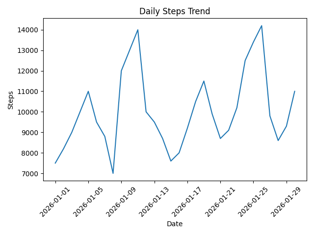
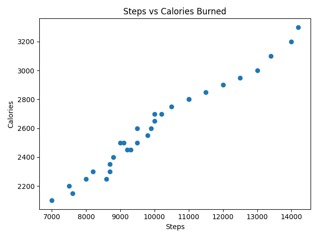
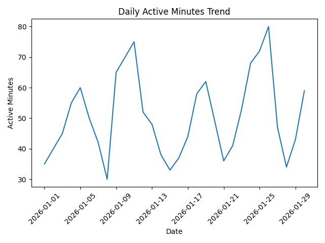
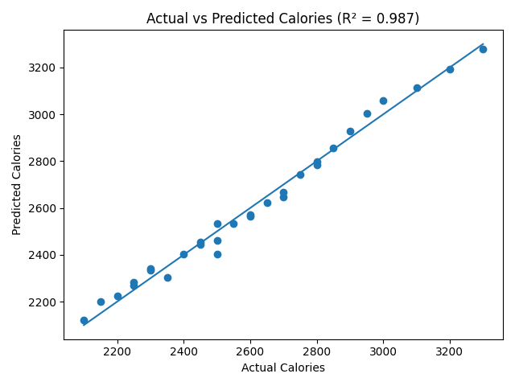

# Fitbit Performance Analytics

---

## Executive Summary

This project applies exploratory data analysis and multiple linear regression to wearable activity data in order to quantify the primary drivers of calorie expenditure and identify behavioral performance trends.

The objective was to transform passive tracking data into predictive performance intelligence that supports measurable decision-making.

---

## Business Problem

Wearable devices generate high volumes of behavioral data. However, most users lack structured insight into what actually drives changes in performance output.

This project demonstrates how predictive modeling can convert raw activity metrics into measurable, explainable outcomes.

---

## Dataset

Daily time-series activity data including:

- Total Steps  
- Active Minutes  
- Calories Burned  

---

## Analytical Approach

- Exploratory Data Analysis (EDA)
- Correlation Analysis
- Feature Engineering
- Multiple Linear Regression
- Model Evaluation using R²

---

## Visual Analysis

### Daily Steps Trend

This time-series view highlights behavioral variability across the 30-day observation window.

---

### Steps vs. Calories Relationship

A clear positive relationship exists between step count and calorie expenditure.

---

### Active Minutes Trend

Active minutes show similar variability patterns and serve as a strong performance signal.

---

### Regression Model: Actual vs Predicted

The regression model demonstrates strong explanatory power, confirming that steps and active minutes significantly predict calorie expenditure.

---

## Key Findings

- Active minutes are a strong contributor to calorie output.
- Step volume reliably correlates with performance.
- Behavioral rhythm patterns are visible in time-series trends.
- Regression modeling provides measurable predictive capability.

---

## Stakeholder Takeaways (So What?)

- Increasing active minutes produces the strongest lift in output.
- Step volume alone is informative, but intensity improves prediction.
- Predictive modeling enables proactive performance planning.

---

## Tools Used

- Python  
- Pandas  
- Matplotlib  
- Scikit-Learn  
- Jupyter Notebook  

---

## Deliverables

- Executive presentation deck  
- Regression model with evaluation metrics  
- Visualizations for stakeholder reporting  
